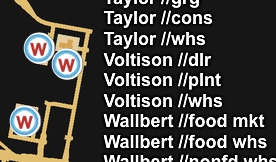

## Show company branches

The **Show company branches** mod changes the names of certain in-game
companies to add an identifier for the company branch.

For example, where previously all Gallon Oil locations would just be labeled
**Gallon Oil**, with this mod active, oil wells and storage sites will instead
be labeled **Gallon Oil /well** and **Gallon Oil /str**, respectively.
This disambiguation helps players who drive without simulated GPS navigation
to more easily find the correct destination in cities such as Moab that have
both kinds of Gallon Oil locations.



The branch identifiers are abbreviations: **str** stands for storage site,
**qry** stands for quarry and so on. Obviously, players still need to know where
inside a city a given company branch can be found. Possible sources for
that knowledge include:

* [ATS Company/Facility Directory — C/FD](https://github.com/nautofon/cfd)
* [ATS IRL map](https://forum.scssoft.com/viewtopic.php?t=285700)
* the search field in the [ATS slippy map](https://forum.scssoft.com/viewtopic.php?t=318267)
* the player's memory

### Using the script

Simply executing the `Show_company_branches.pl` script will generate the
`.scs` mod file, ready for use in the game.

The generated mod file will always be tailored for the ATS version
and the list of DLC you have currently installed.
The mod file will be placed in a new directory next to the script.
The directory's name will be your currently installed game version number.
Invoking the script with `--help` will display available options.

This script is designed to run on macOS and other Unix-y systems.
You need [Perl](https://www.perl.org) to run it, version 5.36 or later.
Note that while your operating system probably comes with Perl
pre-installed, it might have too old a version, so you may need to
first install a newer Perl.

The Perl modules this script depends on can be installed using
[cpanminus](https://metacpan.org/pod/App::cpanminus) like this:

```sh
cpanm --cpanfile cpanfile --installdeps \
  https://github.com/nautofon/Show_company_branches.git
```

### Installing the mod

Please see the [`release`](https://github.com/nautofon/Show_company_branches/tree/release)
git branch to download archived and ready-to-use versions of this mod.

The file you generate or download is named `Show_company_branches.scs`.
To install the mod, simply place it into your game's `mod` directory
and activate it in the Mod Manager, which is accessible from the game's
title screen.
The location of the game's `mod` directory depends on your platform:

* on macOS: `~/Library/Application Support/American Truck Simulator/mod`
* on Linux: `~/.local/share/American Truck Simulator/mod`
* on Windows: `%USERPROFILE%\Documents\American Truck Simulator\mod`

Note that the mod file name does not contain a version number.
This will make it easier for you to upgrade the mod to later versions.

### Author and copyright

Copyright © 2023 [nautofon](https://github.com/nautofon)

If you like this mod, please let me know! Feel free to post issue reports,
support requests, and other feedback in the discussion thread on the SCS forum:

<https://forum.scssoft.com/viewtopic.php?t=326360>

Some rights reserved. This script is free software; you can
redistribute it and/or modify it under [Perl 5 terms](LICENSE).

(The actual mod file that this script generates is not copyrighted.)
